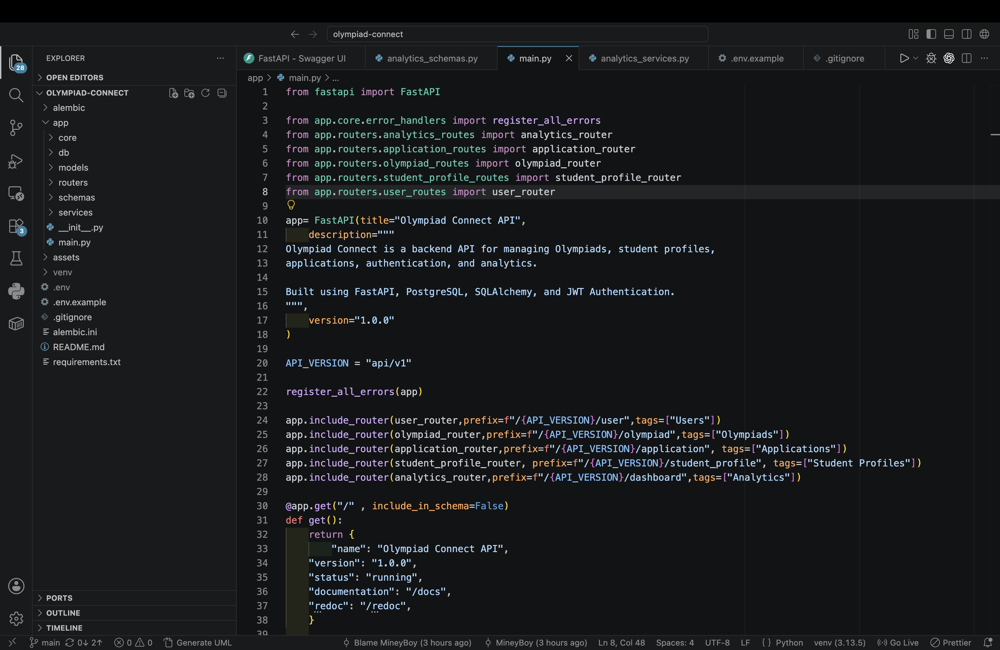
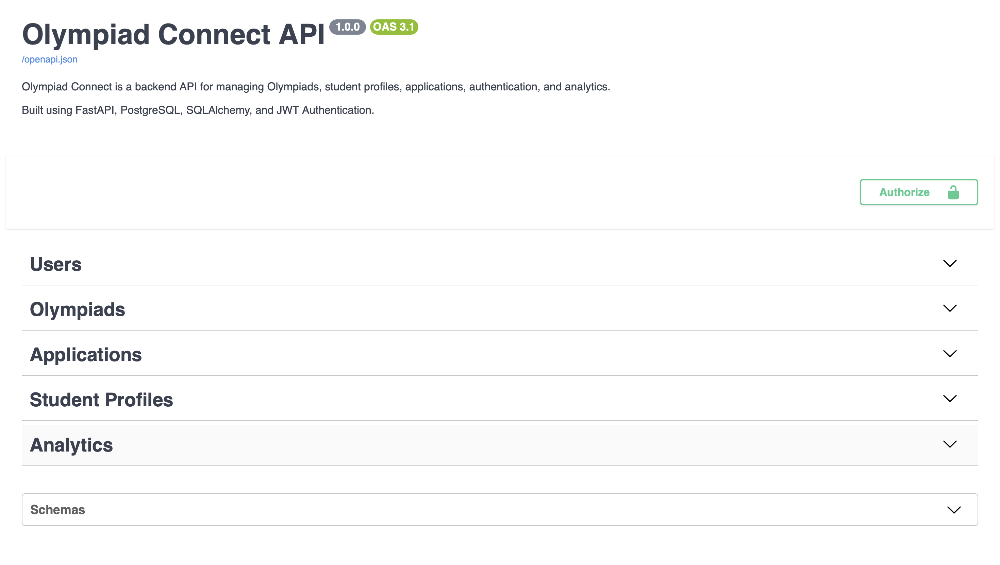
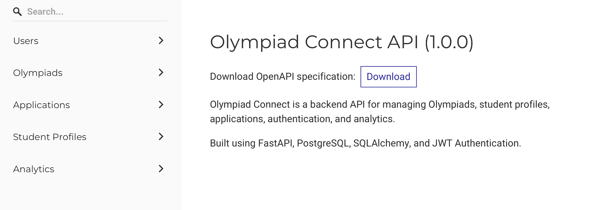
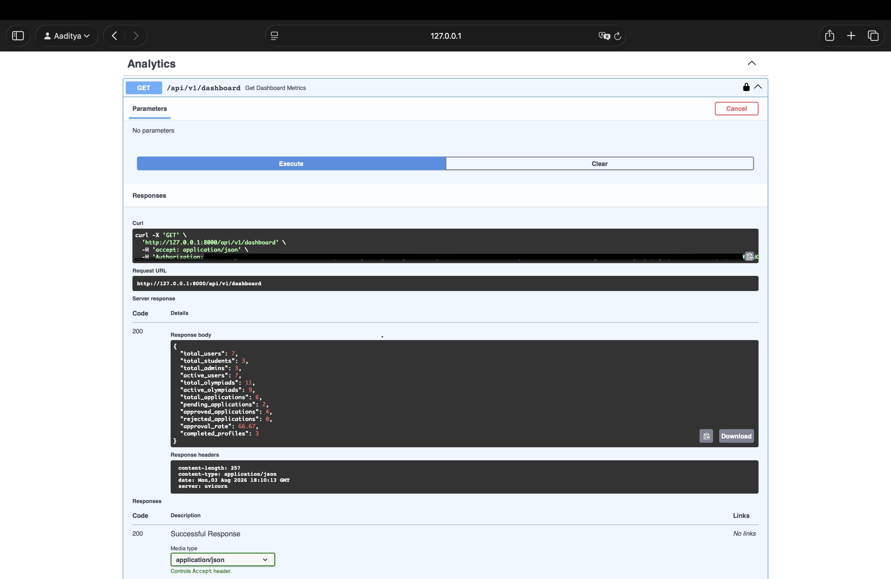

# 🏆 Olympiad Connect

<div align="center">

### A production-oriented FastAPI backend for managing Olympiads, built while exploring real-world backend engineering concepts.


🚀 **30+ REST APIs • JWT Authentication • HTTPBearer • RBAC • PostgreSQL • SQLAlchemy • Alembic**

</div>

---

# 🚀 Overview

Olympiad Connect is a **FastAPI-powered backend application** designed to simplify Olympiad management for students and administrators.

Rather than being a simple CRUD application, this project focuses on applying **real-world backend engineering concepts** while learning FastAPI. It demonstrates authentication, authorization, modular architecture, database design, analytics, API documentation, and production-oriented backend practices.

The project is designed to continuously evolve as new backend concepts are explored and implemented, making it both a learning journey and a portfolio-ready backend application.

---

## 📌 Project Snapshot

| Item | Details |
|------|---------|
| 🚧 Status | Actively Developed |
| 🚀 REST APIs | 30+ |
| 👥 User Roles | Student · Admin · Super Admin |
| 🏗️ Architecture | Layered & Service-Based |
| 🔐 Authentication | JWT + HTTPBearer |
| 🗄️ Database | PostgreSQL |
| 📦 ORM | SQLAlchemy |
| 📖 Documentation | Swagger UI & ReDoc |

---

# 🎯 Why Olympiad Connect?

While learning FastAPI, I wanted to build something beyond tutorial-based CRUD applications.

Olympiad Connect was created to explore how production backend systems are designed by implementing concepts such as:

- Secure Authentication
- Role-Based Authorization
- Modular Architecture
- Database Migrations
- Analytics
- Service Layer Design
- Clean API Architecture

The goal is not only to build a functional application but also to continuously improve it by adopting backend engineering best practices.

---

# 🎯 Design Goals

The primary objectives of this project are:

- Build scalable REST APIs.
- Design a modular backend architecture.
- Apply secure authentication and authorization.
- Gain practical experience with SQLAlchemy ORM.
- Explore PostgreSQL database design.
- Learn database versioning using Alembic.
- Follow clean coding practices.
- Build a backend that can continue evolving with additional features.

---

# 🏗️ System Architecture

```text
                    Client
                       │
                       ▼
                 FastAPI Routers
                       │
          Authentication / Authorization
                       │
                Dependency Injection
                       │
                  Service Layer
                       │
          SQLAlchemy ORM & Models
                       │
                   PostgreSQL
                       ▲
                    Alembic
```

### Architecture Overview

The application follows a **layered architecture** where responsibilities are separated across routers, services, schemas, models, and the database layer. This structure keeps the codebase modular, maintainable, and easier to scale as the project grows.

---

# 📂 Project Structure

```text
olympiad-connect/
│
├── app/
│   ├── core/
│   ├── db/
│   ├── models/
│   ├── routers/
│   ├── schemas/
│   ├── services/
│   ├── utils/
│   └── main.py
│
├── alembic/
├── assets/
├── requirements.txt
├── README.md
├── .env.example
└── alembic.ini
```

### Folder Responsibilities

| Folder | Responsibility |
|---------|----------------|
| `core` | Configuration, authentication, shared utilities |
| `db` | Database connection and session management |
| `models` | SQLAlchemy ORM models |
| `routers` | API endpoints |
| `schemas` | Pydantic request and response models |
| `services` | Business logic |
| `utils` | Helper utilities |


---

# ✨ Features

Olympiad Connect is built around multiple backend modules, each responsible for a specific part of the system.

## 🔐 Authentication & Authorization

- JWT Authentication
- HTTPBearer Protected Routes
- Role-Based Access Control (RBAC)
- Email Verification
- Password Reset Workflow
- Protected Administrative Endpoints

---

## 👥 User Management

- User Registration
- User Login
- User Profile Management
- Activate / Deactivate Users
- Promote / Demote Administrators
- Super Admin Privileges

---

## 🎓 Student Profile Management

- Create Student Profiles
- Update Student Information
- Profile Completion Tracking
- View Student Details

---

## 🏆 Olympiad Management

- Create Olympiads
- Update Olympiads
- Activate / Deactivate Olympiads
- View Available Olympiads

---

## 📝 Application Management

- Submit Olympiad Applications
- Review Applications
- Approve / Reject Applications
- Track Application Status

---

## 📊 Analytics Dashboard

- User Statistics
- Student Statistics
- Olympiad Statistics
- Application Statistics
- Approval Rate
- Dashboard Metrics

---

# 🛠️ Tech Stack

| Category | Technologies |
|-----------|--------------|
| **Language** | Python |
| **Framework** | FastAPI |
| **Validation** | Pydantic |
| **Authentication** | JWT, HTTPBearer |
| **Password Security** | Passlib |
| **Token Management** | itsdangerous |
| **Email Services** | FastAPI-Mail, aiosmtplib |
| **Database** | PostgreSQL |
| **ORM** | SQLAlchemy |
| **Database Migrations** | Alembic |
| **Configuration** | Pydantic Settings, Python Dotenv |
| **API Documentation** | Swagger UI, ReDoc |
| **ASGI Server** | Uvicorn |
| **Version Control** | Git & GitHub |

---

# 🧠 Backend Concepts Implemented

This project explores several backend engineering concepts beyond basic CRUD operations.

### 🏗️ Architecture

- Layered Architecture
- Modular Project Structure
- Service Layer Pattern
- Separation of Concerns

### 🌐 API Design

- RESTful API Development
- Request Validation
- Response Validation
- Standardized API Responses
- Interactive API Documentation

### 🔐 Security

- JWT Authentication
- HTTPBearer Authentication
- Role-Based Access Control (RBAC)
- Password Hashing
- Email Verification
- Password Reset Tokens

### 🗄️ Database

- SQLAlchemy ORM
- PostgreSQL
- Database Relationships
- Alembic Database Migrations

### ⚙️ Backend Practices

- Dependency Injection
- Environment-based Configuration
- Modular Code Organization
- Configuration Management

---

# 🔒 Security Features

Security is one of the primary focuses of Olympiad Connect.

### Authentication

- JWT-based Authentication
- HTTPBearer Protected Endpoints
- Token-based Session Management

### Authorization

- Role-Based Access Control
- Student Access
- Admin Access
- Super Admin Access

### Password Security

- Password Hashing using Passlib
- Secure Password Verification

### Account Protection

- Email Verification
- Password Reset Workflow
- Protected Administrative APIs

---

# 📈 Project Highlights

- 🚀 30+ REST APIs
- 👥 3 User Roles
- 📂 5 Backend Modules
- 🔐 JWT Authentication
- 🛡️ RBAC Implementation
- 📧 Email Verification
- 🔄 Password Reset Workflow
- 📊 Analytics Dashboard
- 🗄️ PostgreSQL Database
- ⚡ SQLAlchemy ORM
- 🔄 Alembic Database Migrations
- 📖 Swagger UI & ReDoc Documentation


---

# 📚 Backend Modules

Olympiad Connect is organized into independent backend modules, each responsible for a specific part of the application.

| Module | Description |
|---------|-------------|
| 🔐 Authentication | User registration, login, email verification, password reset, JWT generation, and authentication workflows. |
| 👥 Users | User management, role management, account activation, and administrative operations. |
| 🎓 Student Profiles | Create, update, retrieve, and manage student profile information. |
| 🏆 Olympiads | Create, update, activate, deactivate, and manage Olympiad details. |
| 📝 Applications | Submit applications, review submissions, approve/reject requests, and track application status. |
| 📊 Analytics | Dashboard metrics, user statistics, Olympiad statistics, application statistics, and approval rate analytics. |

> 📖 Every module follows the same layered architecture using **Routers → Services → Models → Database**, making the project modular, maintainable, and scalable.

---

# 🔄 Request Lifecycle

Every API request follows a structured flow before a response is returned.

```text
                HTTP Request
                      │
                      ▼
              FastAPI Router
                      │
                      ▼
        Dependency Injection Layer
(Authentication • Authorization • Validation)
                      │
                      ▼
              Service Layer
(Business Logic & Application Rules)
                      │
                      ▼
            SQLAlchemy ORM
                      │
                      ▼
               PostgreSQL
                      │
                      ▼
        Pydantic Response Model
                      │
                      ▼
               HTTP Response
```

### Request Flow

1. The client sends an HTTP request.
2. FastAPI routes the request to the appropriate endpoint.
3. Dependencies validate authentication, authorization, and request data.
4. Business logic is executed inside the service layer.
5. SQLAlchemy communicates with PostgreSQL.
6. Data is validated using Pydantic response models.
7. A structured HTTP response is returned to the client.

---

# 🗄️ Database Design

The application uses PostgreSQL with SQLAlchemy ORM to model relationships between users, student profiles, Olympiads, and applications.

```text
                    Users
                      │
         ┌────────────┴────────────┐
         │                         │
         ▼                         ▼
 Student Profiles           Applications
                                      │
                                      ▼
                                 Olympiads
```

### Relationship Overview

- One User can own one Student Profile.
- One Student can submit multiple Applications.
- One Olympiad can receive multiple Applications.
- Admins manage Olympiads and Applications.
- Super Admins manage administrative users and system-level operations.

---

# ⚙️ Installation

### 1️⃣ Clone the Repository

```bash
git clone https://github.com/Aadi2104/olympiad-connect.git
cd olympiad-connect
```

### 2️⃣ Create a Virtual Environment

```bash
python -m venv .venv
```

Activate the virtual environment.

**Windows**

```bash
.venv\Scripts\activate
```

**Linux / macOS**

```bash
source .venv/bin/activate
```

### 3️⃣ Install Dependencies

```bash
pip install -r requirements.txt
```

### 4️⃣ Configure Environment Variables

Create a `.env` file using the provided `.env.example`.

### 5️⃣ Apply Database Migrations

```bash
alembic upgrade head
```

### 6️⃣ Run the Development Server

```bash
uvicorn app.main:app --reload
```

The API will be available at:

- Swagger UI → `http://localhost:8000/docs`
- ReDoc → `http://localhost:8000/redoc`

---

# 🔑 Environment Variables

Create a `.env` file inside the project root.

```env
# Database
DATABASE_URL=

# Authentication
SECRET_KEY=
ALGORITHM=
ACCESS_TOKEN_EXPIRY_MINUTES=

# Email Verification
SIGNUP_TOKEN_EXPIRY_MINUTES=
RESET_PASSWORD_TOKEN_EXPIRY_MINUTES=

# Mail Configuration
MAIL_USERNAME=
MAIL_PASSWORD=
MAIL_FROM=
MAIL_FROM_NAME=
MAIL_SERVER=
MAIL_PORT=
MAIL_STARTTLS=
MAIL_SSL_TLS=
```

> ⚠️ Never commit your `.env` file. Keep sensitive credentials private and use `.env.example` as the template.

---

# 📸 Project Preview

> The following screenshots provide a quick overview of the application's structure and API documentation.

## 🏠 Project Structure

> Modular folder structure following a layered architecture.

<!-- Add Screenshot -->


---

## 📖 Swagger UI

> Interactive API documentation for testing and exploring endpoints.

<!-- Add Screenshot -->



---

## 📚 ReDoc Documentation

> Clean and detailed API reference generated automatically by FastAPI.

<!-- Add Screenshot -->


---

## 📊 Analytics Dashboard API

> Example analytics response showcasing dashboard metrics.

<!-- Add Screenshot -->

---

# 📈 Project Statistics

| Metric | Value |
|---------|------:|
| 🚀 REST APIs | 30+ |
| 📂 Backend Modules | 6 |
| 👥 User Roles | 3 |
| 🛡️ Authentication | JWT + HTTPBearer |
| 🗄️ Database | PostgreSQL |
| ⚡ ORM | SQLAlchemy |
| 🔄 Database Migrations | Alembic |
| 📖 API Documentation | Swagger UI & ReDoc |

---

# 🛣️ Roadmap

## ✅ Completed

- JWT Authentication
- HTTPBearer Authentication
- Role-Based Access Control (RBAC)
- Email Verification
- Password Reset Workflow
- User Management
- Student Profile Module
- Olympiad Management
- Application Management
- Analytics Dashboard
- PostgreSQL Integration
- SQLAlchemy ORM
- Alembic Database Migrations
- Swagger UI & ReDoc Documentation

---

## 🚧 Currently Working On

- Refresh Token Authentication
- Secure Logout
- API Response Improvements

---

## 📅 Planned

- API Testing with Pytest
- Docker Support
- CI/CD Pipeline
- Cloud Deployment
- AI-powered Features
- Performance Optimizations

---

# 💡 Learning Outcomes

Building Olympiad Connect has helped me gain practical experience with:

- Designing RESTful APIs using FastAPI
- Structuring scalable backend applications
- Implementing JWT Authentication and Role-Based Access Control
- Managing PostgreSQL databases using SQLAlchemy ORM
- Versioning database schema with Alembic
- Building secure authentication workflows
- Designing modular service-layer architecture
- Documenting APIs using Swagger UI and ReDoc
- Applying backend development best practices

---

# 🚀 Future Vision

Olympiad Connect is an evolving backend project.

The goal is to continue improving it by implementing production-ready backend features such as refresh token authentication, Docker support, automated testing, cloud deployment, CI/CD, and AI-powered capabilities while continuously exploring modern backend engineering practices.

---

# 🌟 About This Project

This project was not built after mastering FastAPI.

It was built **while learning FastAPI**, with every feature representing a new concept explored, implemented, and refined.

Instead of following isolated tutorials, the focus has always been on applying backend engineering concepts to a real-world application. As new technologies and best practices are learned, they are integrated into the project, making Olympiad Connect a continuously evolving backend system.

---

# 🤝 Contributing

Contributions, ideas, suggestions, and feedback are always welcome.

If you'd like to improve Olympiad Connect:

1. Fork the repository.
2. Create a feature branch.
3. Commit your changes.
4. Open a Pull Request.

---

# 📄 License

This project is licensed under the MIT License.

---

<div align="center">

### ⭐ If you found this project interesting, consider giving it a star!

**Thank you for visiting Olympiad Connect! 🚀**

</div>